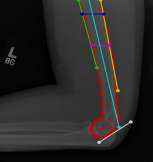

# Project title
Calculation of Baumann angle using deep learning methods.

## Description

## Dataset
The dataset used is publicly available [Musculoskeletal Radiographs (MURA)](https://stanfordmlgroup.github.io/competitions/mura/)  dataset from Standford ML group. The MURA dataset consist of X-ray images of elbows. The objective is to calculate the Baumann angle from the X-ray images. The images are not annotated by default and looks like this:

So, the images are labelled with [Labelme](https://github.com/wkentaro/labelme) for 8 distinct points. 
Those are: Humerus, Posterior Border Line, Anterior Border Line, Proximal Shaft Intersection, Distal Shaft Intersection, Shaft Centerline, Tangent, Articular Block. 
Once the images are annotated, and two lines are draw, and the angle between them is calculated. The angle is the Baumann angle. The annotated images look like this:

## Libraries used
- numpy
- pandas
- matplotlib
- PyTorch
- torchvision
- PIL
- sklearn
- albumentations

## Authors

